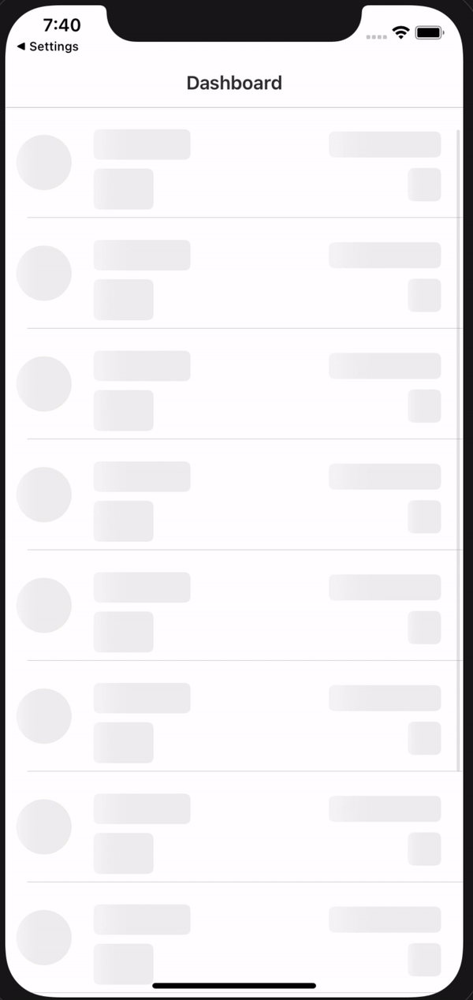
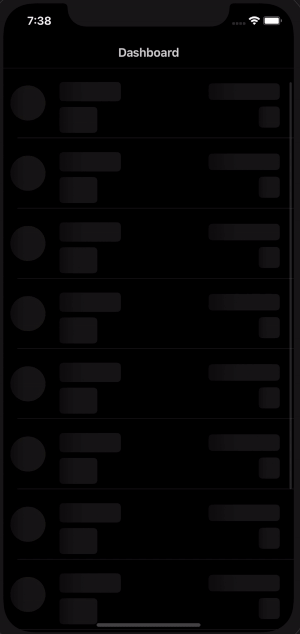

# UIView-Shimmer

[](https://travis-ci.com/omerfarukozturk/UIView-Shimmer)

> Simple way to apply shimmering effect to any UIView.


## Installation

> Copy related extensions to your project.

```
UIView+Extensions.swift
UIView+Template.swift
UIView+Shimmer.swift
```


## Usage 

> Conform any view to `ShimmeringViewProtocol` which identifies that shimmering animation will be applied to it or specified subviews. Define which subviews are animated in `shimmeringAnimatedItems`.

```swift
final class SampleTableViewCell: UITableViewCell, ShimmeringViewProtocol {
    
    @IBOutlet weak var profileImageBackgroundView: UIView!
    @IBOutlet weak var nameLabel: UILabel!
    @IBOutlet weak var actionButton: UIButton!
    @IBOutlet weak var secondLabel: UILabel!
    @IBOutlet weak var secondActionButton: UIButton!
    
    var shimmeringAnimatedItems: [UIView] {
        [
            profileImageBackgroundView,
            nameLabel,
            actionButton,
            secondLabel,
            secondActionButton
        ]
    }
}


```

> Or alternatively you can define that a type of view will be animated just extending `ShimmeringViewProtocol`

```swift
extension UILabel: ShimmeringViewProtocol { }
extension UIButton: ShimmeringViewProtocol { }
extension UITextView: ShimmeringViewProtocol { }
... 
```

> Then call `setShimmeringAnimationWithSubviews(template:superviewBackgroundColor:)` extension of `UIView` for any view (basically a superview). This function finds all descendand subviews to be set as template and applies animation.

```swift
view.setShimmeringAnimationWithSubviews(template: true, superviewBackgroundColor: .systemBackground)
```

Light Theme                | Dark Theme
:-------------------------:|:-------------------------:
  |  


## Example 
The exmple project demonstrates hot to use it. Check [ShimmerExamples](/ShimmerExamples).

## License
UIView-Shimmer is available under the MIT license. See the LICENSE file for more info.
